<h1 align="center">Ömer Çakır</h1>

  3rd year <b>CTIS</b> student at <b>Bilkent University</b> 🎓

  
  
  

<!-- lowlighter/metrics tarafından otomatik üretilir (.github/workflows/metrics.yml) -->

  

<i>Thanks for stopping by ✨</i>

